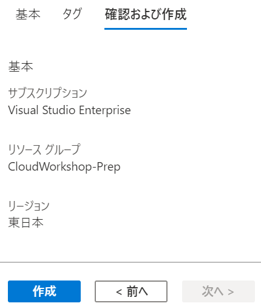
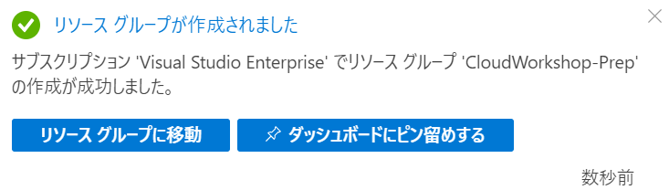
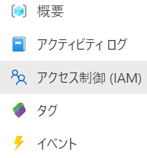
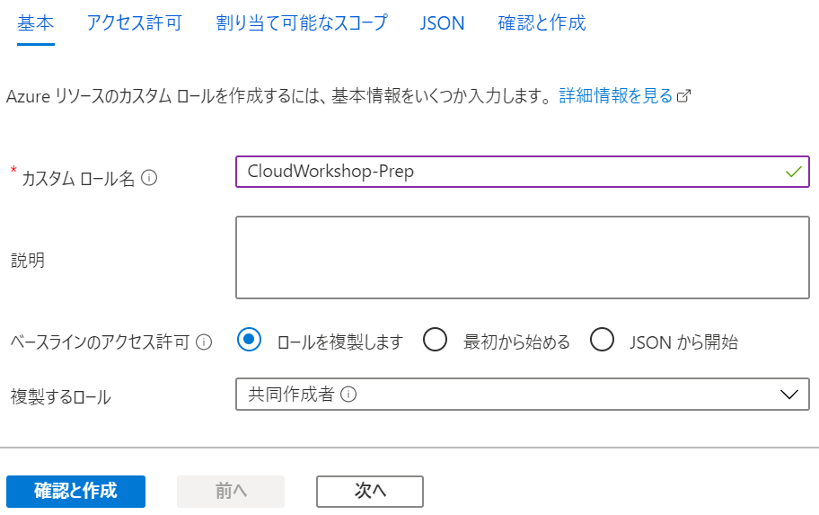
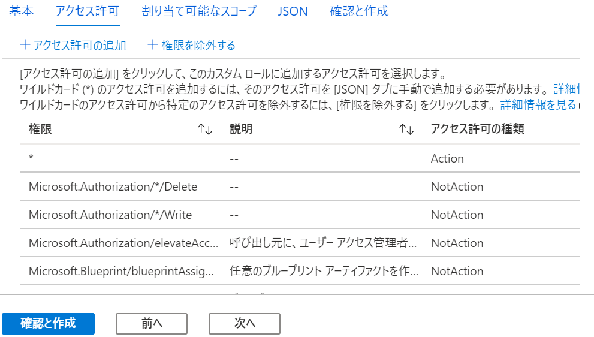
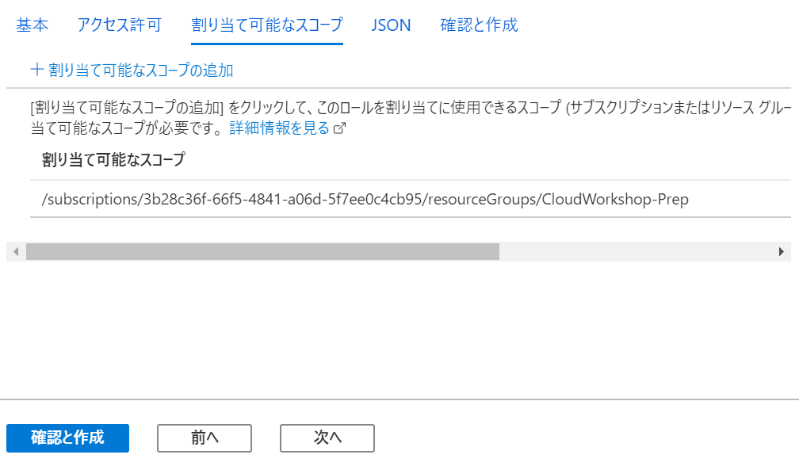
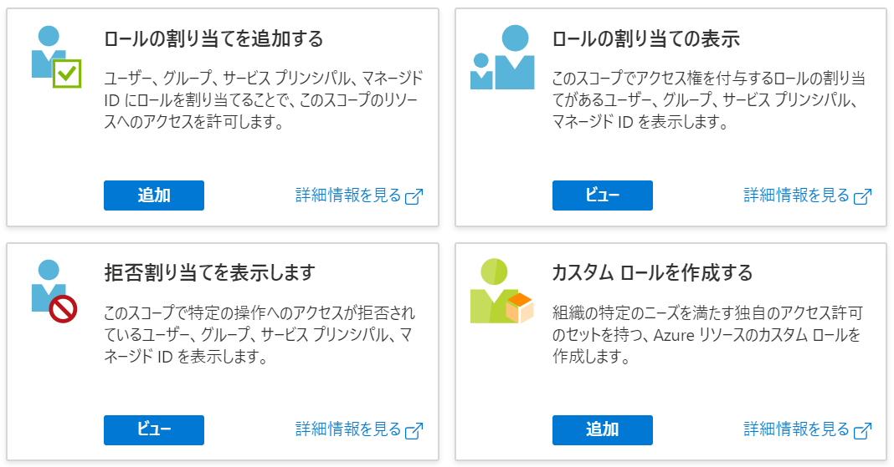
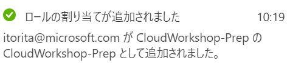

  
  
Server migration  
Hands-on lab  
July 2020  
  
   
  
**Contents**  
  
- 環境のセットアップ  
  - Task 1: リソースグループの作成  
  - Task 2: リソースグループへのアクセス権限の付与  
  - Task 3: 仮想ネットワークの作成  
  - Task 4: Azure Active Directory Domain Services の作成  
  - Task 5: Azure Bastion の展開  
  - Task 6: Windows Server 2012 R2 仮想マシンの作成  
  - Task 7: SQL Server 2012 仮想マシンの作成  
  - Task 8: Windows 10 仮想マシンの作成  
  - Task 9: 仮想マシンのドメイン参加  
  - Task 10: Windows Server 2012 R2 への Web サーバー ロールの追加
    - Sub Task 1: IIS への Web アプリケーションの展開  
    - Sub Task 2: 共有フォルダの作成と .pdf ファイルの複製  
  - Task 11: SQL Server データベースの復元  
  - Task 12: Web アプリケーションの動作確認  
  
## **環境のセットアップ**  
  
  
### **Task 1: リソースグループの作成**  
  
1. Web ブラウザーから **Azure ポータル**（<https://portal.azure.com>）を開く  
  
2. **＋リソースの作成** をクリック  
     
  
3. 画面上部の検索ボックスに **Resource group** と入力し表示される候補から **Resouce Group** を選択  
     
  
4. **作成**をクリック  
     
  
5. **基本**タブで、次を入力し**確認および作成**をクリック  
   - **リソースグループ名**（任意、サブスクリプション内で一意）  
   - **リージョン**（任意、このワークショップで使用する地域）  
     
  
6. **確認および作成**タブで**作成**をクリックし新しいリソースグループを作成  
     
  
7. 正常にリソースグループが作成されたことを確認  
     
  
  
### **Task 2: リソース グループへのアクセス権限の付与**  
  
1. ホーム画面からリソースグループ一覧を表示   
     
  
2. 作成したリソースグループ名をクリック  
     
  
3. **アクセス制御 (IAM)** をクリック  
     
  
4. **カスタム ロールを作成する**の**追加**をクリック  
     
  
5. カスタム ロールの作成の**基本**ブレードで次の構成オプションを指定し**次へ**をクリック  
   - **カスタム ロール名**: 任意  
   - **ベースラインのアクセス許可**: **ロールを複製します** を選択  
   - **複製するロール**: **共同作成者** を選択  
     
  
6. **アクセス許可**タブで割り当てられている許可/除外権限を確認し**次へ**をクリック  
     
  
7. **割り当て可能なスコープ**タブで現在のリソースグループが表示されていることを確認し**確認と作成**をクリック  
     
  
8. **作成**をクリック  
     
  
9. カスタムロールが正常に作成されたメッセージを確認し **OK** をクリック  
     
  
10. リソースグループの**アクセス制御 (IAM)** タブから**ロールの割り当てを追加する**の**追加**をクリック  
     
  
11. **ロール割り当ての追加**フォームで以下の選択を行い**保存**をクリック  
    - **役割**: 上記手順で作成したカスタム ロールを選択  
    - **選択**: 権限を付与するユーザーを選択  
     
      > 作成したカスタム ロールが表示されるまで時間がかかる場合があります。  
  
    Azure AD 外のユーザーを追加する場合はメールアドレスを入力してください。その場合、以下の招待メールが届きます。  
     
   「**Get Started**」をクリックすることで組織へのアクセス権が付与されます。
  
12. カスタムロールが正常に割り当てられたことを確認  
     
  
13. カスタム グループへ追加したユーザーで [Azure ポータル](https://portal.azure.com/)を開き今回作成したリソースグループへアクセス出来ることを確認
  
  
### **Task XX: **  
  
1. action  
     
  
   > memo  
  
   - list  
   - list  
     
  
     > memo  
  
2. action  
     
  
   > memo  
  
   - list  
   - list  
     
  
     > memo  
  
3. action  
     
  
   > memo  
  
   - list  
   - list  
     
  
     > memo  
  
4. action  
     
  
   > memo  
  
   - list  
   - list  
     
  
     > memo  
  
5. action  
     
  
   > memo  
  
   - list  
   - list  
     
  
     > memo  
  
6. action  
     
  
   > memo  
  
   - list  
   - list  
     
  
     > memo  
  
7. action  
     
  
   > memo  
  
   - list  
   - list  
     
  
     > memo  
  
8. action  
     
  
   > memo  
  
   - list  
   - list  
     
  
     > memo  
  
9. action  
     
  
   > memo  
  
   - list  
   - list  
     
  
     > memo  
  
10. action  
      
   
    > memo  
  
    - list  
    - list  
      
  
      > memo  
  
