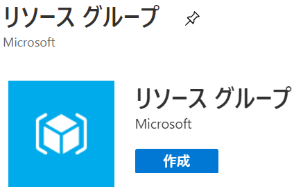

  
  
Server migration  
Hands-on lab  
July 2020  
  
   
  
**Contents**  
  
- 環境のセットアップ  
  - Task 1: リソース グループの作成  
  - Task 2: リソース グループへのアクセス権限の付与  
  - Task 3: 仮想ネットワークの作成  
  - Task 4: Azure Active Directory Domain Services の作成  
  - Task 5: Azure Bastion の展開  
  - Task 6: Windows Server 2012 R2 仮想マシンの作成  
  - Task 7: SQL Server 2012 仮想マシンの作成  
  - Task 8: Windows 10 仮想マシンの作成  
  - Task 9: 仮想マシンのドメイン参加  
  - Task 10: Windows Server 2012 R2 への Web サーバー ロールの追加
    - Sub Task 1: IIS への Web アプリケーションの展開  
    - Sub Task 2: 共有フォルダの作成と .pdf ファイルの複製  
  - Task 11: SQL Server データベースの復元  
  - Task 12: Web アプリケーションの動作確認  
  
## **環境のセットアップ**  
memo  
  
### **Task 1: リソース グループの作成**  
このタスクでは、ワークショップで使用するリソース グループの作成を行います。リソース グループは、Azure ソリューションの関連するリソースを保持するコンテナーであり、グループ内のすべてのリソースで同じライフサイクルを共有します。  
  
1. Web ブラウザーから **Azure ポータル**（<https://portal.azure.com>）を開く  
  
2. **＋リソースの作成** をクリック  
     
  
3. 画面上部の検索ボックスに **Resource group** と入力し表示される候補から **Resouce Group** を選択  
     
  
4. **作成**をクリック  
     
  
5. **基本**タブで、次を入力  
   - **リソースグループ名**（任意、サブスクリプション内で一意）  
   - **リージョン**（任意、このワークショップで使用する地域）  
     
  
6. **確認および作成**をクリック  
    
  
7. **確認および作成**タブで**作成**をクリックし新しいリソース グループを作成  
     
  
8. 正常にリソースグループが作成されたことを確認  
     
  
### **Task 2: **  
memo  
  
1. -  
   > memo  
  
     
  
2. -  
   > memo  
  
     
  
3. -  
   > memo  
  
     
  
4. -  
   > memo  
  
     
  
5. -  
   > memo  
  
     
  
6. -  
   > memo  
  
     
  
7. -  
   > memo  
  
     
  
8. -  
   > memo  
  
     
  
9. -  
   > memo  
  
     
  
10. -  
   > memo  
  
     
  
### **Task XX: **  
memo  
  
1. -  
   > memo  
  
     
  
2. -  
   > memo  
  
     
  
3. -  
   > memo  
  
     
  
4. -  
   > memo  
  
     
  
5. -  
   > memo  
  
     
  
6. -  
   > memo  
  
     
  
7. -  
   > memo  
  
     
  
8. -  
   > memo  
  
     
  
9. -  
   > memo  
  
     
  
10. -  
   > memo  
  
     