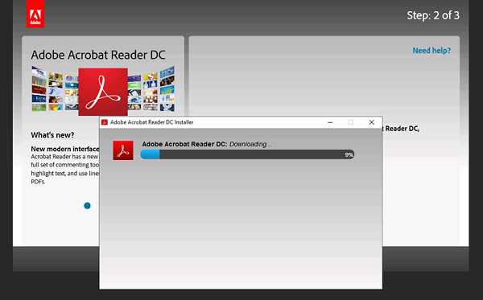

Server migration  
Hands-on lab  
July 2020

 

**Contents**
- Server Migration before the hands-on lab setup guide
  - [Task 1: リソース グループのプロビジョニング](#task-1-リソース-グループのプロビジョニング)
  - [Task 2: 仮想ネットワークと Azure Bastion のプロビジョニング](#task-2-仮想ネットワークと-azure-bastion-のプロビジョニング)
    - 仮想ネットワークとネットワーク セキュリティ グループ
    - Azure Bastion
  - [Task 3: Active Directory ドメイン サービスの展開](#task-3-active-directory-ドメイン-サービスの展開)
    - Active Directory ドメイン サービス
    - 仮想ネットワークの DNS 設定
    - グループ ポリシーの作成
  - [Task 4: 仮想マシンのプロビジョニング](#task-4-仮想マシンのプロビジョニング)
  - [Task 5: 仮想マシンの設定](#task-5-仮想マシンの設定)
    - Web サーバー
      - IIS のインストール
      - ASP.NET Web アプリケーションの展開
      - 共有フォルダの作成
    - データベース サーバー
      - データベースのアタッチ
    - 開発マシン
      - ASP.NET アプリケーション ソース コードのコピー
      - モダン ブラウザ（Edge, Chrome, Firefox いずれか）のインストール
      - Adobe Reader のインストール
  - [Task 6: 動作確認](#task-6-動作確認)

  > **IMPORTANT**: Azure リソースは Resource Manager Template を使用し展開  
  各リソースのプロビジョニング ページ（README）でパラメーターや設定内容を確認すること  

   

# Before the hands-on lab

## Task 1: リソース グループのプロビジョニング
ハンズオン ラボで使用するリソースのコンテナーとして機能するリソース グループを作成  
- <a href="https://portal.azure.com" target="_blank">Azure ポータル</a>から作成、もしくは、<a href="azure-templates/01-resource-group/README.md" target="_blank">リソースのプロビジョニング ページ</a>で「Deploy to Azure」ボタンをクリック

## Task 2: 仮想ネットワークと Azure Bastion のプロビジョニング
移行対象の仮想マシンの展開先となる仮想ネットワークとジャンプボックスとなる Azure Bastion を作成  
仮想ネットワークのサブネットには HTTP/S, FTP のみインターネット通信を許可するネットワーク セキュリティ グループを作成

- <a href="azure-templates/02-vnet-three-subnets/README.md" target="_blank">リソースのプロビジョニング ページ</a> で「Deploy to Azure」をクリック

## Task 3: Active Directory ドメイン サービスの展開
仮想ネットワークで利用するドメイン コントローラーを作成

- <a href="azure-templates/03-domain-services/README.md" target="_blank">リソースのプロビジョニング ページ</a> で「Deploy to Azure」をクリック
- 展開終了後、仮想マシンにログインしド**メイン コントローラーへ昇格**を実行

仮想ネットワークの DNS 設定をドメイン コントローラーの IP アドレスに設定
- <a href="https://portal.azure.com" target="_blank">Azure ポータル</a>にて仮想ネットワークの「DNS サーバー」をカスタムに変更  
作成したドメイン コントローラーの IP アドレスを指定  

仮想マシンに適用するグループ ポリシーの作成
- Windows Installer 使用の有効化  
[Computer Configuration] - [Administrative Templates] - [Windows Components] - [Windows Installer]  
**Turn off Windows Installer**
  - **Enabled** に設定
  - [Disable Windows Installer] を **Never** に設定  
      
- ソフトウェアの制限ポリシーの作成

  [Computer Configuration] - [Windows Settings] - [Security Settings]   **Software Restriction Policies**  
  - Software Restriction Policies を右クリックし **New Software Restriction Policies** を選択  
    
  - **Enforcement** のプロパティを設定

    Apply software restriction policies to the following user: **All users except local administrators**  
    

## Task 4: 仮想マシンのプロビジョニング
Web サーバー、データベース サーバー、開発マシンの３台の仮想マシンを作成

- <a href="azure-templates/04-virtual-machines/README.md" target="_blank">リソースのプロビジョニング ページ</a> で「Deploy to Azure」をクリック

## Task 5: 仮想マシンの設定
展開した各仮想マシンの設定

- **Web サーバー**
  - C ドライブ直下の **_setup** フォルダ内にある PowerShell スクリプトを実行  
  set-webserver.ps1  
        
    - IIS のインストール
    - Web アプリケーションの c:\inetpub\wwwroot へのコピー
    - ドキュメントのダウンロード
  - ASP.NET アプリケーションの作成  
  IIS 管理コンソールから Default Web Site 配下の Contoso を右クリックし**Convert to Application** を選択  

      

  - 共有フォルダの設定  
  C ドライブ直下の Public フォルダを共有フォルダに設定  

  - インターネット経由のファイルダウンロードの有効化  
  IE の設定からファイルダウンロードを有効に変更  

      
- **データベース サーバー**
  - C ドライブ直下の **_setup** フォルダ内にある PowerShell スクリプトを実行  
  set-database.ps1  
      

    - ContosoInsurance データベースをアタッチ  

      
- **開発マシン**
  - C ドライブ直下の **_setup** フォルダ内にある PowerShell スクリプトを実行  
  set-devclient.ps1  
    

  - モダンブラウザのインストール    
    

  - Chrome, Chromium ベースの Edge の場合、PDF をブラウザ内で開くよう拡張機能を設定  
    

  - Adobe Reader をインストール  
      

## Task 6: 動作確認
Web アプリケーションの動作確認

- http://web-svr/Contoso/ へアクセス  
    

- **Manage Policy Holders** をクリック  
    

データベースから情報が取得できることを確認

- **Details** をクリック  
    

- File Path に表示される .pdf ファイル名をクリック
      
PDF ファイルが開くことを確認
