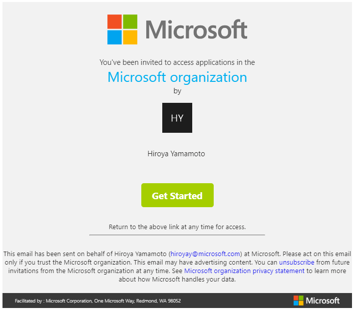
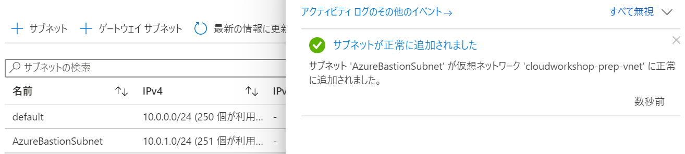
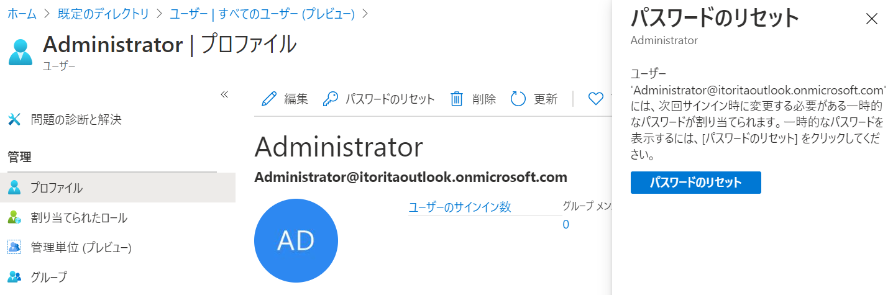
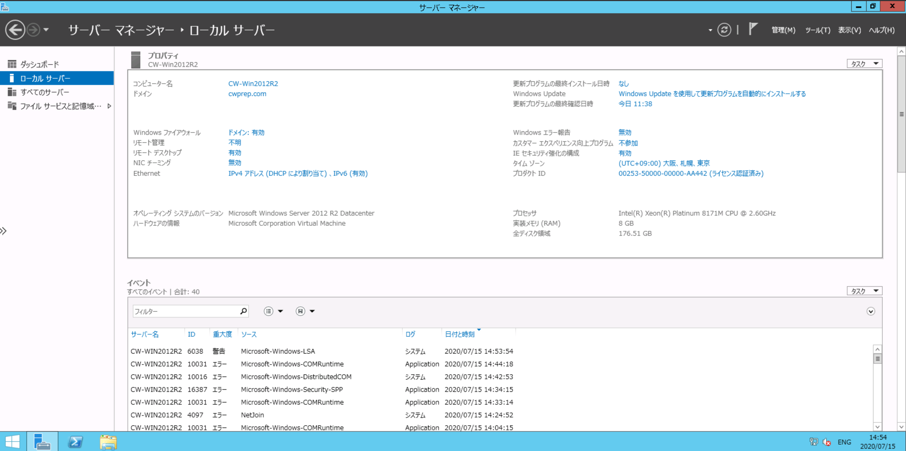

  
  
Server migration  
Hands-on lab  
July 2020  
  
   
  
**Contents**  
  
- 環境のセットアップ  
  - Task 1: リソースグループの作成  
  - Task 2: リソースグループへのアクセス権限の付与  
  - Task 3: 仮想ネットワークの作成  
  - Task 4: Azure Active Directory Domain Services の作成  
  - Task 5: Azure Bastion の展開  
  - Task 6: Windows Server 仮想マシンの作成  
  - Task 7: SQL Server 2012 仮想マシンの作成  
  - Task 8: Windows 10 仮想マシンの作成  
  - Task 9: 仮想マシンのドメイン参加  
  - Task 10: Windows Server 2012 R2 への Web サーバー ロールの追加
    - Sub Task 1: IIS への Web アプリケーションの展開  
    - Sub Task 2: 共有フォルダの作成と .pdf ファイルの複製  
  - Task 11: SQL Server データベースの復元  
  - Task 12: Web アプリケーションの動作確認  
  
## **環境のセットアップ**  
  
  
### **Task 1: リソースグループの作成**  
  
1. Web ブラウザーから **Azure ポータル**（<https://portal.azure.com>）を開く  
  
2. **＋リソースの作成**をクリック  
     
  
3. 画面上部の検索ボックスに **Resource group** と入力し表示される候補から **Resouce Group** を選択  
     
  
4. **作成**をクリック  
     
  
5. **基本**タブで次を入力し**確認および作成**をクリック  
   - **リソースグループ名**: 任意 ( このサブスクリプションで一意 ) 
   - **リージョン**: 任意 ( このワークショップで使用する地域 )  
     
  
6. **確認および作成**タブで**作成**をクリックし新しいリソースグループを作成  
     
  
7. 正常にリソースグループが作成されたことを確認  
     
  
  
### **Task 2: リソースグループへのアクセス権限の付与**  
  
1. ホーム画面からリソースグループ一覧を表示   
     
  
2. 作成したリソースグループ名をクリック  
     
  
3. 左側のブレードから**アクセス制御 (IAM)** をクリック  
     
  
4. **カスタム ロールを作成する**の**追加**をクリック  
     
  
5. カスタム ロールの作成の**基本**ブレードで次の構成オプションを指定し**次へ**をクリック  
   - **カスタム ロール名**: 任意  
   - **ベースラインのアクセス許可**: **ロールを複製します** を選択  
   - **複製するロール**: **共同作成者** を選択  
     
  
6. **アクセス許可**タブで割り当てられている許可/除外権限を確認し**次へ**をクリック  
     
  
7. **割り当て可能なスコープ**タブで現在のリソースグループが表示されていることを確認し**確認と作成**をクリック  
     
  
8. **作成**をクリック  
     
  
9. カスタムロールが正常に作成されたメッセージを確認し **OK** をクリック  
     
  
10. リソースグループの**アクセス制御 (IAM)** タブから**ロールの割り当てを追加する**の**追加**をクリック  
     
  
11. **ロール割り当ての追加**フォームで以下の選択を行い**保存**をクリック  
    - **役割**: 上記手順で作成したカスタム ロールを選択  
    - **選択**: 権限を付与するユーザーを選択  
     
      > 作成したカスタム ロールが表示されるまで時間がかかる場合があります。  
  
    Azure AD 外のユーザーを追加する場合はメールアドレスを入力してください。その場合、以下の招待メールが届きます。  
     
   「**Get Started**」をクリックすることで組織へのアクセス権が付与されます。
  
12. カスタムロールが正常に割り当てられたことを確認  
     
  
13. カスタム グループへ追加したユーザーで [Azure ポータル](https://portal.azure.com/)を開き今回作成したリソースグループへアクセス出来ることを確認
  
  
### **Task 3: 仮想ネットワークの作成**  
  
1. ホーム画面から**リソースの作成**をクリック  
     
  
2. 検索ボックスに **Virtual Network** と入力し表示される候補から **Virtual Network** を選択  
     
  
3. **作成**をクリック  
     
  
4. **基本**タブで次の構成を設定し **IP アドレス**をクリック  
   - プロジェクトの詳細  
       - **サブスクリプション**: ワークショップで使用するサブスクリプション  
       - **リソースグループ**: 先の手順で作成したリソースグループ
   - インスタンスの詳細  
       - **仮想マシン名**: CW-2012R2  
       - **地域**:   
       - **可用性オプション**:   
       - **イメージ**:   
       - **Azure スポット インスタンス**:   
       - **サイズ**:   
  
     
  
5. **IP アドレス**タブで IP アドレス空間とサブネットを確認し**確認および作成**をクリック  
     
  
     > 本ワークショップでは既定の IP アドレス空間 (10.0.0.0/16)、default サブネット (10.0.0.0/24) でまずは作成  
  
6. **確認および作成**タブで**作成**をクリックし新しい仮想ネットワークを作成  
     
  
7. 正常に仮想ネットワークが作成されたことを確認  
     
  
  
### **Task 4: Azure Active Directory Domain Services の作成**  
Windows Server 仮想マシンで Domain Controller を用意する場合はこのタスクはスキップしてください
  
1. ホーム画面から**リソースの作成**をクリック  
     
  
2. 検索ボックスに **Azure AD Domain Services** と入力し表示される候補から **Azure AD Domain Services** を選択  
     
  
3. **作成**をクリック  
     
  
4. **基本**タブで次の構成を設定し **次へ**をクリック  
   - **サブスクリプション**: ワークショップで使用するサブスクリプション
   - **リソースグループ**: 先の手順で作成したリソースグループ
   - **DNS ドメイン名**: 任意のドメイン名  
   - **地域**: リソースグループと同じリージョンを選択  
   - **SKU**: 今回は Standard を選択
   - **フォレストの種類**: ユーザーを選択
     
  
5. **ネットワーク**タブで仮想ネットワークとサブネット選択し**確認および作成**をクリック  
   - **仮想ネットワーク**: 先の手順で作成した仮想ネットワーク
   - **リソースグループ**: 先の手順で作成したリソースサブネット
     
  
6. **確認および作成**タブで**作成**をクリックし注意事項も **OK** をクリックし新しい Azure AD Domain Services を作成  
     
     
   > Azure AD Domain Services は作成完了まで 30 分ほど時間を要しますので、先に次のタスクを実施して構いません
  
7. 正常に Azure AD Domain Services が作成されたことを確認  
     
   > 完了直後に作成した Azure AD Doamin Services のリソースを見に行くと以下のメッセージが表示されている場合がありますが、この後のステップで改めて確認をするのでそれまでは特に対応しなくて構いません
       
  
  
### **Task 5: Azure Bastion の展開**  
  
1. ホーム画面からリソースグループ一覧を表示   
     
  
2. 作成したリソースグループ名をクリック  
     
  
3. 先の手順で作成した仮想ネットワーク名をクリック  
     
  
4. 左側のブレードから**サブネット**をクリックし **+ サブネット**をクリック  
     
  
5. Azure Bastion 用のサブネット情報を設定して **OK** をクリック  
   - **名前**: AzureBastionSubnet  
   - **アドレス範囲**: デフォルト値で構いません  
     > アドレス範囲を変更する場合プレフィックスは少なくとも /27 である必要があります
  
       
  
6. 正常にサブネットが作成されたことを確認  
     
  
7. ホーム画面から**リソースの作成**をクリック  
     
  
8. 検索ボックスに **Bastion** と入力し表示される候補から **Bastion** を選択  
     
  
9. **作成**をクリック  
     
  
10. **基本**タブで次の構成を設定し **確認および作成**をクリック  
    - プロジェクトの詳細  
       - **サブスクリプション**: ワークショップで使用するサブスクリプション  
       - **リソースグループ**: 先の手順で作成したリソースグループ
    - インスタンスの詳細  
        - **名前**: 任意  
        - **地域**: リソースグループと同じリージョンを選択  
    - 仮想ネットワークを構成します  
        - **仮想ネットワーク**: 先の手順で作成した仮想ネットワーク  
        - **リソースグループ**: 先の手順で作成したサブネット  **AzureBastionSubnet**  
    - パブリック IP アドレス  
        - **パブリック IP アドレス**: 新規作成  
        - **パブリック IP アドレス名**: 任意  
  
        
  
11. **確認および作成**タブで**作成**をクリック  
     
  
12. 正常に Azure Bastion が作成されたことを確認  
     
  
  
### **Task 6: Windows Server 仮想マシンの作成**  
ここでは 1 台 or 2 台の Windows Server を作成します。  
  - **必須**: Web-SVR ( Windows Server 2012 R2 )  
  - **オプション**: DC-SVR ( Windows Server 2019 )  
      - Task 4 で Azure AD Domain Services を作成していない場合は、ここで DC サーバーを作成してください  
  
1. ホーム画面からリソースグループ一覧を表示   
     
  
2. 作成したリソースグループ名をクリック  
     
  
3. 先の手順で作成した仮想ネットワーク名をクリック  
     
  
4. 左側のブレードから**サブネット**をクリックし **+ サブネット**をクリック  
     
  
5. Azure Bastion 用のサブネット情報を設定して **OK** をクリック  
   - **名前**: WindowsSubnet  
   - **アドレス範囲**: デフォルト値で構いません  
     > アドレス範囲を変更する場合プレフィックスは少なくとも /27 である必要があります
  
       
  
6. 正常にサブネットが作成されたことを確認  
     
  
7. ホーム画面から**リソースの作成**をクリック  
     
  
8. 検索ボックスに **Windows Server** と入力し Enter をクリック  
     
  
9. **公開元: 全て**をクリックし **Microsoft** を選択  
     
  
10. **Windows Server** をクリック  
      
  
11. **ソフトウェア プランの選択**で **Windows Server 2012 R2 Datacenter** を選択し**作成**をクリック  
      
    > Domain Contoroler 作成時は Windows Server 2019 を選択してください
  
12. **基本**タブで次の構成を設定し**ディスク**をクリック  
    - プロジェクトの詳細  
       - **サブスクリプション**: ワークショップで使用するサブスクリプション  
       - **リソースグループ**: 先の手順で作成したリソースグループ
    - インスタンスの詳細  
       - **仮想マシン名**: 任意  
       - **地域**: リソースグループと同じリージョンを選択  
       - **可用性オプション**: 可用性ゾーン  
       - **可用性ゾーン**: 1  
       - **イメージ**: Windows Server 2012 R2 Datacenter  
       - **Azure スポット インスタンス**: いいえ
       - **サイズ**: **サイズの選択** をクリックし検索ウインドウ **D2_v3** を選択し**選択**をクリック  
           
  
        
    - 管理者アカウント  
       - **ユーザー名**: 任意  
       - **パスワード**: 任意  
    - 受信ポートの規則  
       - **パブリック受信ポート**: なし  
    - お金を節約  
       - **Windows Server ライセンスを既にお持ちの場合**: いいえ  
      
  
13. **ディスク**タブで次の構成を設定し**ネットワーク**をクリック  
    - ディスクのオプション  
       - **OS ディスクの種類**: Standard SSD  
       - **暗号化の種類**: ( 既定 )
    - データディスク ( ここでの設定は不要です )  
        
  
14. **ネットワーク**タブで仮想ネットワークとサブネット選択し**確認および作成**をクリック  
    - **仮想ネットワーク**: 先の手順で作成した仮想ネットワーク  
    - **リソースグループ**: 先の手順で作成したリソースサブネット  
    - **パブリック IP**: なし  
    - **NIC ネットワーク セキュリティ グループ**: **詳細**を選択し**新規作成**をクリック 
      - 任意の**名前**を入力し **OK** をクリック 
    　　  
    - **高速ネットワーク**: オフ  
    - **負荷分散**: いいえ  
     
   
15. **確認および作成**タブで**作成**をクリックし新しい仮想マシンを作成  
      
  
16. 正常に仮想マシンが作成されたことを確認  
      
  
17. ホーム画面からリソースグループ一覧を表示   
      
  
18. 作成したリソースグループ名をクリック  
      
  
19. 先の手順で作成した仮想マシン名をクリック  
      
  
20. 左側のブレードの**概要**から**接続**をクリックし **Bastion** を選択  
     
  
21. 仮想マシン作成時に設定した**ユーザー名**と**パスワード**を入力し**接続**をクリック  
     
  
22. Azure Bastion 経由で仮想マシンにログインできたことを確認  
     
  
23. コントロールパネルを起動して **Date and Time**, **Language**, **Region** を日本語環境にカスタマイズ  
   - 時刻  
       
   - 場所 ( 再起動が発生するのでログインし直してください )  
       
   - 言語    
       
       
       
       
  
22. 言語パックのインストール完了後改めて Azure Bastion 経由で仮想マシンにログインし日本語化されたことを確認  
     
  
Domain Contoroler を作成する必要がある場合は続けて作成してください  
  
### **Task 7: SQL Server 2012 仮想マシンの作成**  
  
  
### **Task 8: Windows 10 仮想マシンの作成**  
  
1. ホーム画面から**リソースの作成**をクリック  
      
  
2. 検索ボックスに **Windows 10** と入力しと入力し表示される候補から **Microsoft Windows 10** を選択  
      
  
3. **ソフトウェア プランの選択**で **Windows 10 Pro, Version 2004** を選択し**作成**をクリック  
      
  
4. **基本**タブで次の構成を設定し**ディスク**をクリック  
    - プロジェクトの詳細  
       - **サブスクリプション**: ワークショップで使用するサブスクリプション  
       - **リソースグループ**: 先の手順で作成したリソースグループ
    - インスタンスの詳細  
       - **仮想マシン名**: 任意  
       - **地域**: リソースグループと同じリージョンを選択  
       - **可用性オプション**: 可用性ゾーン  
       - **可用性ゾーン**: 1  
       - **イメージ**: Windows Server 2012 R2 Datacenter  
       - **Azure スポット インスタンス**: いいえ
       - **サイズ**: D2_v3  
         
    - 管理者アカウント  
       - **ユーザー名**: 任意  
       - **パスワード**: 任意  
    - 受信ポートの規則  
       - **パブリック受信ポート**: なし  
    - お金を節約  
       - **Windows Server ライセンスを既にお持ちの場合**: いいえ  
         
  
5. **ディスク**タブで次の構成を設定し**ネットワーク**をクリック  
    - ディスクのオプション  
       - **OS ディスクの種類**: Standard SSD  
       - **暗号化の種類**: ( 既定 )
    - データディスク ( ここでの設定は不要です )  
         
  
6. **ネットワーク**タブで仮想ネットワークとサブネット選択し**確認および作成**をクリック  
    - **仮想ネットワーク**: 先の手順で作成した仮想ネットワーク  
    - **リソースグループ**: 先の手順で作成したリソースサブネット  
    - **パブリック IP**: なし  
    - **NIC ネットワーク セキュリティ グループ**: **なし** 
    - **高速ネットワーク**: オフ  
    - **負荷分散**: いいえ  
       
   
7. **確認および作成**タブで**作成**をクリックし新しい仮想マシンを作成  
      
  
8. 正常に仮想マシンが作成されたことを確認  
      
  
9. ホーム画面からリソースグループ一覧を表示   
      
  
10. 作成したリソースグループ名をクリック  
      
  
11. 先の手順で作成した仮想マシン名をクリック  
      
  
12. 左側のブレードの**概要**から**接続**をクリックし **Bastion** を選択  
     
  
13. 仮想マシン作成時に設定した**ユーザー名**と**パスワード**を入力し**接続**をクリック  
     
  
14. Azure Bastion 経由で仮想マシンにログインできたことを確認  
     
  
15. Settings を起動して **Date&Time**, **Language** を日本語環境にカスタマイズし完了後サインアウト  
   - 時刻  
       
   - 言語    
       
       
       
       
       
  
16. 言語パックのインストール完了後改めて Azure Bastion 経由で仮想マシンにログインし日本語化されたことを確認  
     
  
  
### **Task 9: 仮想マシンのドメイン参加 **  
  
1. ホーム画面から **Azure Active Directory** をクリック   
     
  
2. 左側のブレードの**管理**から**ユーザー**をクリック  
     
  
3. **新しいユーザー**をクリック  
     
  
4. **ユーザーの作成**で以下の情報を入力し**作成**をクリック  
   - **ID**  
       - **ユーザー名**: 任意  
       - **名前**: 任意  
   - **パスワード**  
       - **自分でパスワードを作成する**  
       - **初期パスワード**: 任意  
         
   - **グループとロール**  
       - **グループ**: **0 個のグループが選択されました**をクリック 
           - **AAD DC Administorators** を選択し**選択**をクリックし元の設定画面のメッセージが **1 個のグループが選択されました**となっていることを確認
       - **役割**: ユーザー  
         
  
5. ユーザーが正常に作成されたことを確認  
     
  
6. ホーム画面からリソースグループ一覧を表示  
     
  
7. 作成したリソースグループ名をクリック  
     
  
8. 先の手順で作成した Azure AD Domain Services 名をクリック   
     
  
9. 左側のブレードの**設定**から**正常性**をクリックし **Azure AD との同期**で表示されている時刻が先ほどユーザーを作成した時刻より後になっていることを確認  
     
  
10. 左側のブレードの**設定**から**プロパティ**をクリックし**仮想ネットワーク上の IP アドレス**を確認  
     
  
11. ホーム画面からリソースグループ一覧を表示  
      
  
12. 作成したリソースグループ名をクリック  
      
  
13. 先の手順で作成した仮想ネットワーク名をクリック  
      
  
14. 左側のブレードの**設定**から **DNS サーバ**をクリックし以下の項目を設定し**保存**をクリック  
    - **DNS サーバー**: カスタム  
    - **DNS サーバの追加**: 先の手順で確認した IP アドレスを入力  
     
  
15. ホーム画面からリソースグループ一覧を表示  
      
  
16. 作成したリソースグループ名をクリック  
      
  
17. 先の手順で作成した仮想マシン名をクリック  
      
  
18. 左側のブレードの**概要**から**再起動**をクリックし再び**状態**が**実行中**となるまで待つ    
      
  
19. 左側のブレードの**概要**から**接続**をクリックし **Bastion** を選択  
      
  
20. 仮想マシン作成時に設定した**ユーザー名**と**パスワード**を入力し**接続**をクリック  
      
  
21. Azure Bastion 経由で仮想マシンにログインできたことを確認  
      
  
22. ログインした仮想マシンから Azure AD Domain Services で構成したドメインに参加  
      
    > ドメイン参加時にユーザー、パスワード情報に関するエラーが発生する場合があります。  
    その場合、Azure AD のユーザー管理画面からパスワードリセットを行ってください。  
     
    その上で新たに発行された一時パスワードを用いて [Office365](https://www.office.com/?omkt=ja-jp) にログインしてパスワード変更を行ってください。  
     
     
  
23. ドメインに正常に参加できたことを確認しサーバの再起動を実行  
      
  
24. 改めてサーバーにログインしドメインに参加出来ていることを確認  
      
  
25. **9-17** 以降のステップを SQL Server, Windows 10 それぞれでも実行  
    
 
 
